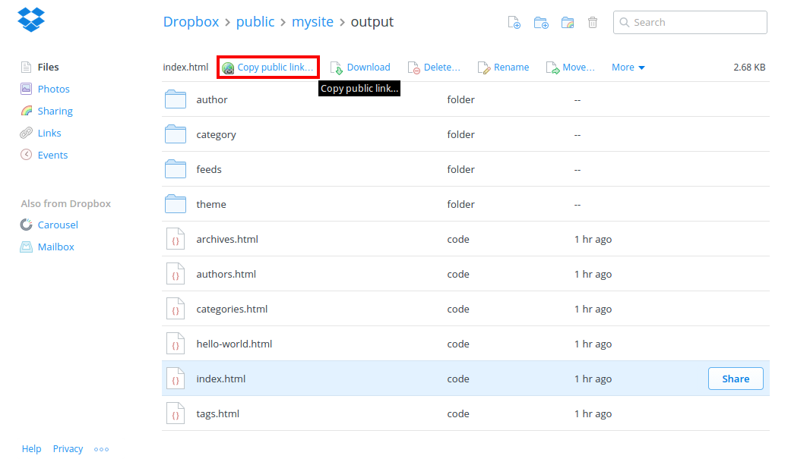
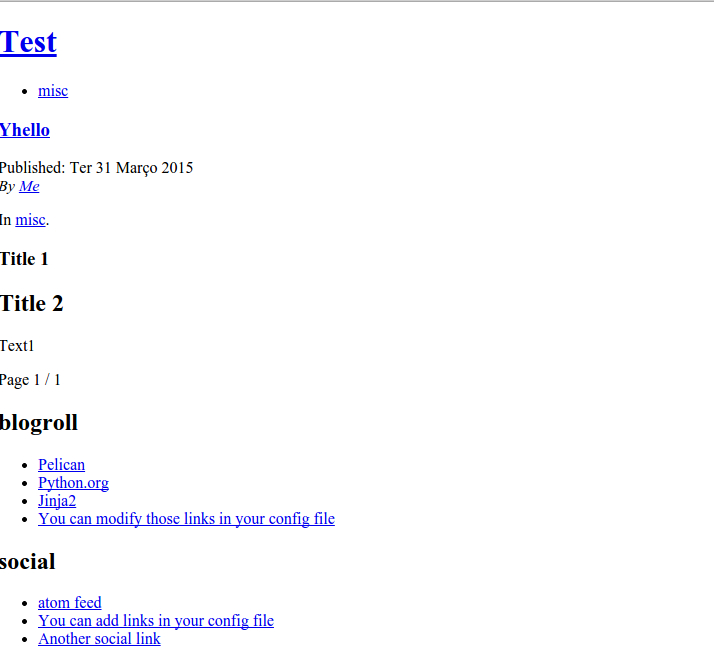

Title: Hosting a website in Dropbox
Date: 2015-03-31 10:19
Category: 
Tags: dropbox

This entry will serve as a short documentation on how to set up a Pelican website hosted in Dropbox. I'm running Ubuntu, so the commands used work in that environment. Analogue steps can be taken for PC and Mac.

# Why host in Dropbox?
You might imediately think why would you like to host a website in Dropbox. There are several reasons:
- You have a prototype website you want to demo. Dropbox offers a quick and easy way to have it online and running.
- You have a simple website you'd like to share with other people.
- bla ble bli

# Disadvantages
There are some disadvantages to having a website hosted on Dropbox though:
- It has some quirks with custom domains (more on that later)
- It can only serve static pages, which means you can forget any server side goodies (no wordpress hosting for instance)
- 

# Setting up Dropbox

I will forego the details of creating a [Dropbox](https://www.dropbox.com/) account. Just make sure that you have a Public directory. This directory will have your website inside. Dropbox serves this directory by default.

# Setting up Pelican

## Why Pelican?
I chose [Pelican](http://blog.getpelican.com/) because it's a Python based static site generator. Being Python means I can understand the code and develop it further for my own needs. Being a static site generator basicly means that I can host it in a variety of places (e.g. GitHub), manage it easily and publish by uploading a simple file and running a script (which I don't even have to run if I upload the final HTML). Plus, I can write in simple *markdown*.

## Installation
If you have [pip](https://pypi.python.org/pypi/pip) the installation is as forward as

```bash
pip install pelican
pip install markdown
```

*Run `pip install markdown` only if you want to write in markdown*.

And it's done. Easy right?

## Setting up

Now there's two options to setting up Pelican in Dropbox:
- have the whole Pelican setup inside Dropbox;
- have only the static sites you want Dropbox to serve.

I went with the former because I wanted to have the whole thing self-contained. This will allow me to easily rebuild the website from anywhere with access to Dropbox and Python. I might change this in the future. I'll tell how to do the later as well.

Navigate to the *Public* folder in Dropbox. I recommend creating a folder to hold your website. We'll run the Pelican *quickstart* method to setup the whole thing.

```bash
mkdir -p mywebsite
pelican-quickstart
```

The application will ask several questions to assist in creating the website. You can skip most of them and let Pelican set up with default values. When asked `What is your URL prefix?`, answer `Y` if you have a custom domain set up (I'll cover this later) and specify that domain.

I said I would tell to set up with the second option (have only the static sites you want Dropbox to serve), and this is done in this step. When asked `Do you want to upload your website using Dropbox? (y/N)`, answer `y`. Then, write down the directory to which Pelican should publish the website (this still has to be inside the *Public* folder - it can be the *Public* folder itself). The rest of the Pelican set up may or may not be inside the *Public* folder - if it is, I recommend for it to be in a different directory that the one used to <publish class=""></publish>

```bash    
> Where do you want to create your new web site? [.] 
> What will be the title of this web site? MyTestWebsite
> Who will be the author of this web site? DiogoAOS
> What will be the default language of this web site? [en] 
> Do you want to specify a URL prefix? e.g., http://example.com   (Y/n) Y
> What is your URL prefix? (see above example; no trailing slash) http://www.diogoaos.eu
> Do you want to enable article pagination? (Y/n) 
> How many articles per page do you want? [10] > Do you want to generate a Fabfile/Makefile to automate generation and publishing? (Y/n) 
> Do you want an auto-reload & simpleHTTP script to assist with theme and site development? (Y/n) 
> Do you want to upload your website using FTP? (y/N) 
> Do you want to upload your website using SSH? (y/N) 
> Do you want to upload your website using Dropbox? (y/N) 
> Do you want to upload your website using S3? (y/N) 
> Do you want to upload your website using Rackspace Cloud Files? (y/N) 
> Do you want to upload your website using GitHub Pages? (y/N)
```

From inside the Pelican folder, run `make publish` to publish your whole website. There are other `make` options that you can explore.

You can now access your Dropbox hosted website. To get the link go into your website directory using the website navigator, enter the *output* folder, click the *index.html* file and click the *Copy public link* button on the top.



That is the direct link for you website. It is also the link you'd use to redirect your custom domain. Test drive the website by pasting the link into the browser. If the website looks like the image below, don't be alarmed - it's a absolute path problem.



.. figure:: {filename}/images/pelican_abs_link.jpg
    :align: right

By default, Pelican uses absolute paths on all it's links. That means the HTML files are trying go the resources that are actually inside the computer (which Dropbox can't access) instead of the ones that are inside the website directory. The configuration file *pelicanconf.py* in the Pelican folder has to be modified to use relative paths. Open this file and search for *RELATIVE_URLS*. By default, it's already there commented. If it isn't just add the following to the end.

```python
RELATIVE_URLS = True
```

This file is responsible for a [myriad](http://docs.getpelican.com/en/latest/settings.html) of configuration settings in Pelican. It's written in Pythn syntax so you can add comments to the configurations by writing after a `#`.


There you have it, it should now look like something that doesn't hurt your eyes.

While writing for the website or fiddling with the configurations, I like to have a local webserver where I can instantly see the effects of my actions. Pelican already comes with this built-in. From the Pelican website folder just run `make devserver` and the website should be available at `http://localhost:8000` from a browser. This server will actively respond to changes in the configurations and auto generate all the content, in real time. When satisfied, I just have copy the contents of the *output* folder. `make stopserver` will stop the webserver.
